# Meeting: Tuesday 7/10/25
# Aim: provide some proof of concept for DEC being a valid method of simulation

## Laplacian Square Eigenvalue Problem

### Formulation

#### Laplacian Equation

The aim of this is to provide a proof of concept for DEC being applied to solve equations

The equation to solve is a simple laplacian eigenvalue problem:

$\nabla^2 \phi = -\lambda \phi$.

Writing this in exterior calculus form:

$\nabla^2 = d \delta + \delta d$,

where $d$ is the derivative operator and $\delta$ is the codifferential.

If the scalar field $\phi$ is assumed to be divergence free, and the divergence of a scalar field  is given by $\delta \phi$ in exterior calculus, the $\nabla$ operator can be simplified to:

$\nabla^2 = \delta d$

The codifferential is converted to DEC form as:

$\delta \rightarrow \star^{-1} d^{-1} \star$,

hence the Laplacian is converted to DEC as:

$\nabla^2 \rightarrow \star^{-1} d^{-1} \star d$.

#### Chen and Chew (pg. 66-7)

For a scalar field $\phi$, the Laplacian is given by:

$\nabla^2 \phi = \nabla \cdot \nabla \phi$,

where the Laplacian $\nabla^2$ is translated to DEC as:

$\nabla^2 \rightarrow -(d^{-1}_0 \star_1 d_0)$.

#### Final DEC Eigenproblem Formulation

Representing the scalar field $\phi$ as a 0-form (with values defined on mesh vertices), the eigenproblem can be formulated in DEC as:

$(\star^{-1}_0 d^{-1}_0 \star_1 d_0) \phi = \lambda \phi$.

Here, the operators have the following effects (in a 3D space):
* $d_0$: primal 0-cochain $\rightarrow$ primal 1-cochain
* $\star_1$: primal 1-cochain $\rightarrow$ dual 1-cochain
* $d^{-1}_0$: dual 1-cochain $\rightarrow$ dual 2-cochain
* $\star^{-1}_0$: dual 2-cochain $\rightarrow$ primal 0-cochain

with the Hodge star $\star^{-1}_0$ converting the result of the $\nabla^2$ operation back into the primal mesh to maintain consistent dimensionality in the formulation. 

#### Boundary Conditions

A slowly increasing absorption layer was used to simulate an infinite outer zone, with a complex refractive index component increasing the closer to the boundary that the points were.

### Results

The code for this simulation is found in the $Laplace\_square()$ function. 

This also utilises the $FibreSolution$ class to handle basic the mesh generation and plotting, despite the uniform refractive index of $\epsilon = 1.$ throughout the material. Additionally, the solutions are found using the $FibreSolution.solve\_with\_dirichlet\_boundary()$ function, which enforces a Dirichlet boundary condition of $\phi = 0$ around the edge of the simulation area.

Eigenvalues are printed as a list, eigenvalue modes are plotted, and radial cross-section plots are created for the first few modes.

Fig. 1: Lowest order mode

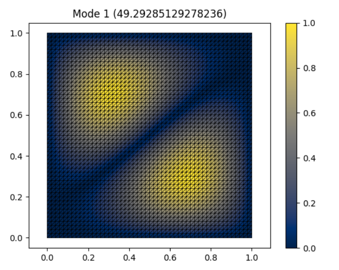
Fig. 2: Second lowest order mode

The eigenvalues were sampled from the centre at $(0.5, 0.5)$ to the edge at $(1., 0.5)$ to generate a radial plot for the modes. 

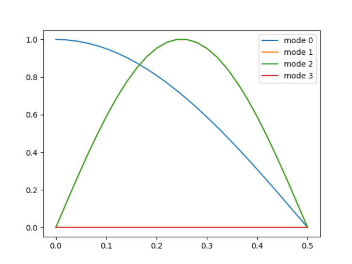
Fig. 3: Simulated mode shapes

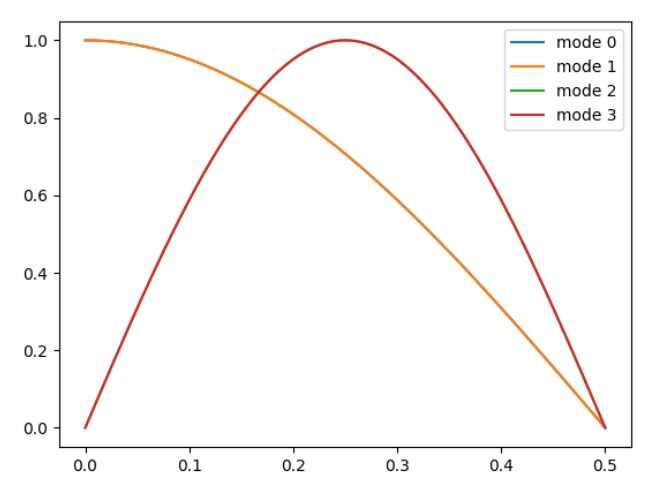
Fig. 4: Analytical mode shapes

Note, there is a difference between the mode shapes for modes 1 and 3 (by index).

I believe this is due to the first modes being diagonally shaped, which in turn may be due to the mesh having diagonal triangles rather than x-y symmetry.

### Analysis

The first few modes are also calculated analytically, and their eigenvalues and corresponding radial mode profiles plotted for comparison.

The simulated eigenvalues are found to be a good match with the theoretical values, and the radial plots (by magnitude) are also similar. This supports the premise that DEC is a valid tool for solving eigenvalue problems.

# Meeting: Tuesday 14/10/25
# Aim: Implement adaptive mesh size, make boundary PML circularly symmetrical, test circular drum pattern

## Adaptive Mesh dev log - 14/10/25

An adaptive mesh was created for simulating something with a single circular core. This was done by using an adaptive mesh size which was recalculated for each radial layer starting from the centre. The normalised distance of a point to the core edge was calculated using the equation:

$p = |r - r_c| / s_m$,

where $p$ is the proportional value between $0$ and $1$, $r$ is the distance of the point from the centre, $r_c$ is the core radius, and $s_m$ is the distance over which the step  size should go from minimum to maximum. The step size for this radius is then calculated using linear interpolation between the minimum and maximum step sizes ($s_{min}$ and $s_{max}$ respectively):

$s = s_{min} + p * (s_{max} - s_{min})$,

where $s$ is the step size used for this layer.

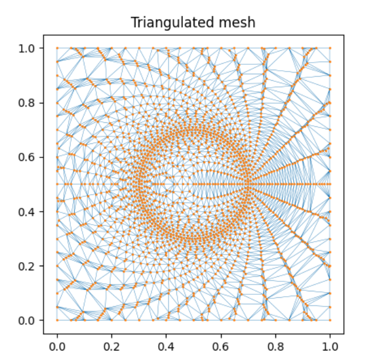

Fig. 1: This image was the original version, but the radius was only being increased by the minimum mesh size each layer

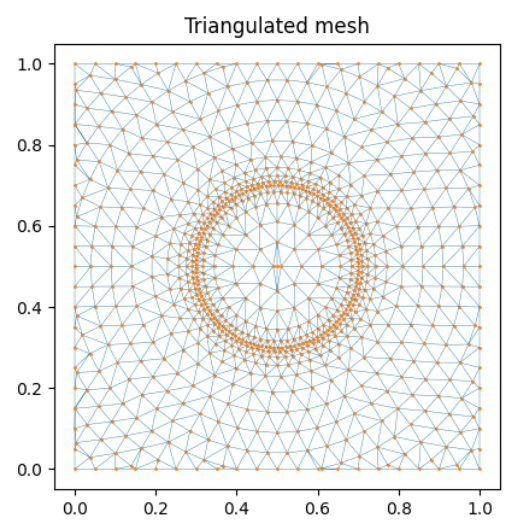

Fig. 2: This image was adding the mesh size for the certain radius each time, so that the distance between layers was approximately the same as the last distance between points on the layer. This led to a more even spacing on points rather than closely packed layers of sparse points.

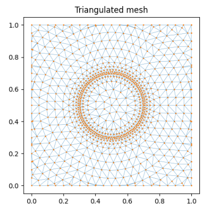

Fig. 3: This image has the initial mesh step size calculated from the centre point, rather than simply setting it to the minimum mesh size. This leads to a more even central distribution of points.

## DEC Bessel Laplacian modifications

The Inverse Hodge star was modified to account for the PML absorption index rather than using the default DEC inverse Hodge. This immediately allowed identification of the cladding states through their high imaginary component of their eigenvalues. For the images below, the buffer layer was set to increase up to a value of $10^3$ over a distance of $0.1$.

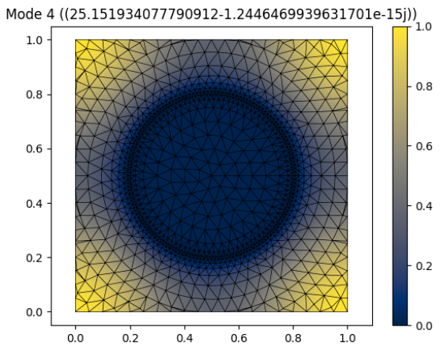

Fig. 1: This image demonstrates one of the spurious cladding modes that existed initially, which had a complex eigenvalue component of approximately the same as the modes on the drum surface (inside the core).

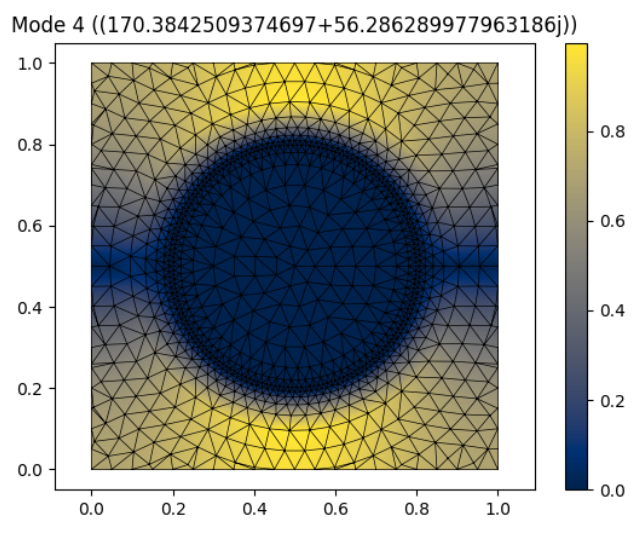

Fig. 2: The same mode, but calculated with the PML-modified Hodge star. It can be seen that the imaginary component of the eigenvalue is much greater now, and can thus be identified as a cladding mode which is not desired. 

## Wave beta Laplacian modifictions - 15/10/25

Used the PML Hodge inverse rather than the full epsilon Hodge inverse. This led to the refractive index of the eigenmodes being between the core and cladding frequencies finally!

# DEC Bessel Simulation Overview

Equation being solved is:

$\nabla ^2 \phi = -\lambda \phi$. 

When $\nabla ^2$ is expressed in polar coordinates and circular symmetry is assumed, then the equation becomes separable. The radial solutions are given by Bessel's functions, which are classified by "order" $n$.

A radial field function is plotted by interpolating between the resulting eigenvectors (defining the field solution on the vertices). These field functions are plotted against the radius for the different modes.
Some of the modes are degenerate and have angular solutions such that the radial field is approximately zero along the y=0.5 axis (the axis of symmetry for the setup). These can be filtered out by ignoring radial functions where the maximum value is small compared to the maximum field value.

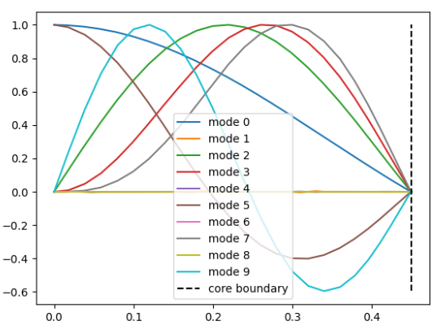

Fig. 1: The radial functions from DEC simulation of the vibrational modes of the drum, normalised such that their maximum value is 1.

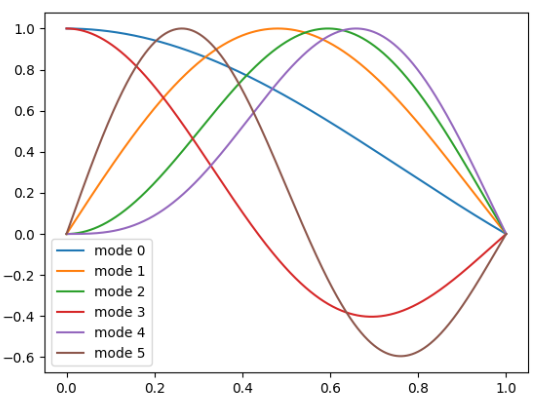

Fig. 2: The analytical Bessel functions, automatically normalised such that the highest value is 1 by design.

# Catchup Thursday 16/10/25

## ToDo - Consider nuances of comparison between DEC result and analytic result

### Comparison and error analysis

To compare the DEC results to the analytic results, we have to integrate the analytic results over the simplices. This is because the result that is stored by DEC is the integral of the scalar function over the simplex.

Alternatively, an approximation would be to evaluate the DEC function at the barycentres.

Method:
* Integrate the square of the full 2D Bessel solution over the interior of the drum
* Square the phi wavefunction results
* Compare the two

Compare how the mesh size affects this, also compare adaptive mesh etc.

The plots were scaled so that the maximum values of the DEC and analytical results matched, then their difference was calculated by subtracting the DEC values from the analytical values. The results are shown below:

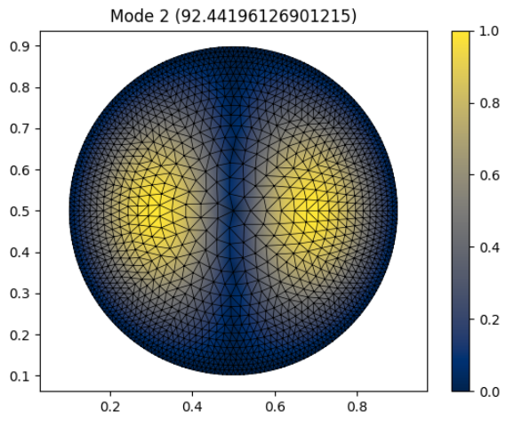

Fig. 1: DEC solution for mode 2 (n=1, m=0).

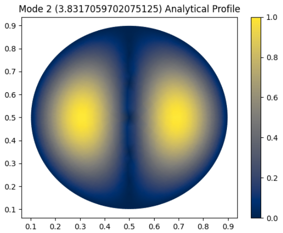

Fig. 2: Analytical solution for mode 2.

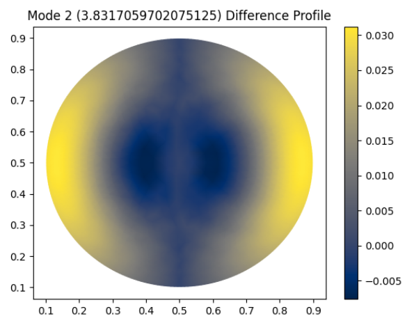

Fig. 3: Difference between the two plots.

### Periodic boundaries

The mesh points on the edge should connect to the similar points on the opposite side

### Circular meshing (Done 17/10/25)

Create a circular mesh that stops at the Dirichlet boundary rather than using a PML. An example of this is shown in Fig. 1

It was noted that the meshes would not smoothly decrease in size, due to the large mesh steps at the centre going deep into the zone where it should be reduced before the new mesh step size is calculated (see Fig. 2). This is a consequence of generating the mesh starting from the centre where there is a large step size. The algorithm for mesh generation was modified to start from the boundary instead, with the results shown in Fig. 3.

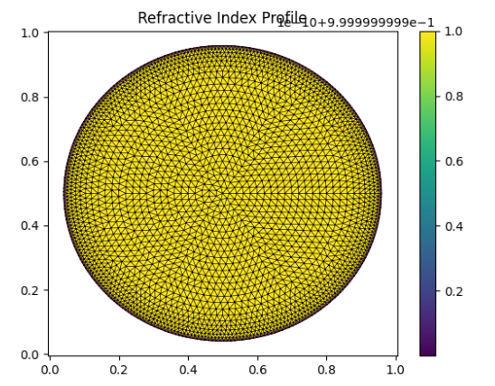

Fig. 1: The mesh was redesigned to be circular and end at the drum boundary, for the Bessel vibrational mode simulation

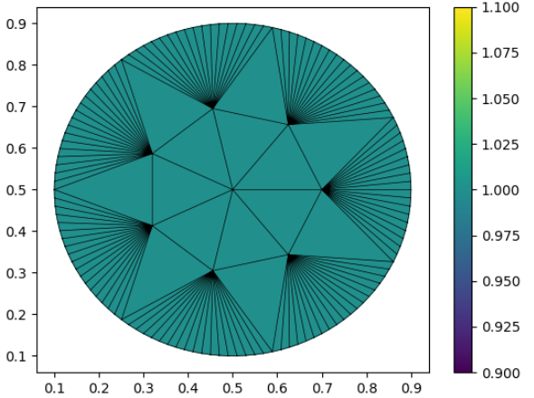

Fig. 2: The meshing algorithm starts from the large centre step size, so for simulations with a large difference in minimum and maximum step size, this leads to some sub-optimal mesh designs.

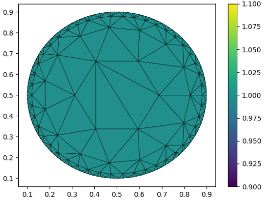

## Notes

Typically, PML is modelled using squares that are radially symmetric, however this is quite possibly just to make the finite difference algorithms work well. For DEC, since it is exact, this should not be a problem and triangles should suffice throughout for the meshing. This has the additional advantage of being easier to create the mesh through a routine such as Delauney triangulation. 

# Meeting Tuesday 21/10/25

## Periodic boundary conditions
Check that this works for the drum as well

### Sum squares of all errors in plots, graphs of how mesh size controls it

The difference between the analytical and DEC solutions were calculated, and are displayed in Fig. 1 . These were scaled by multiplying by the dual area of the point at which the difference was calculated, then re-normalised by dividing by the area of the drum face.

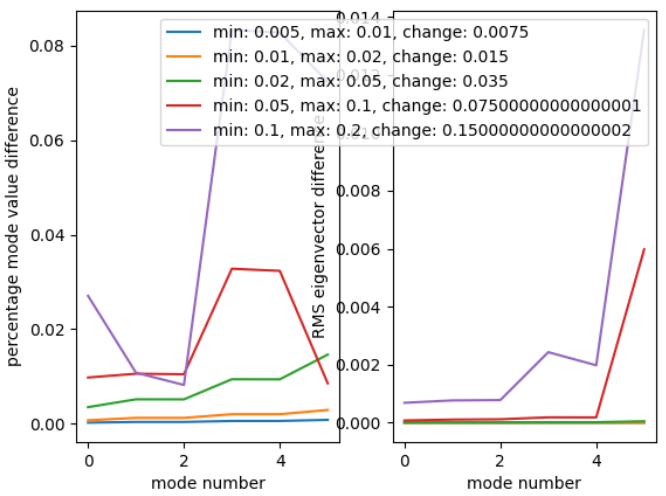

Fig. 1: Difference between analytical and simulated mode vertex values, for the lowest 6 modes of the vibrating drum.

This figure displays that as the mesh size increases, the agreement between the DEC solution and analytical solution gets drastically worse. This is particularly apparent for the modes with high radial dependence such as the 6th mode, and for a mesh with a maximum vertex separation of at least 0.1.

### Consider fibres (simple, Dirichlet conditions)
Tubular cladding with a Dirichlet boundary

# Catchup Thursday 23/10/25

### CuPy

Test GPU acceleration using CuPy
CuPy has sparse matrix solvers that should be compatible with SciPy sparse matrices
- Convert SciPy sparse matrix to CuPy sparse matrix
- Solve CuPy sparse matrix using CuPy solvers
- Convert back to SciPy matrices for plotting etc.

https://deepwiki.com/cupy/cupy/5.2-sparse-matrix-operations

* Convert from SciPy to CuPy
scipy_sparse_matrix = scipy.sparse.csr_matrix(...)
cupy_sparse_matrix = cupyx.scipy.sparse.csr_matrix(scipy_sparse_matrix)

* Convert from CuPy to SciPy
scipy_sparse_matrix = cupy_sparse_matrix.get()

