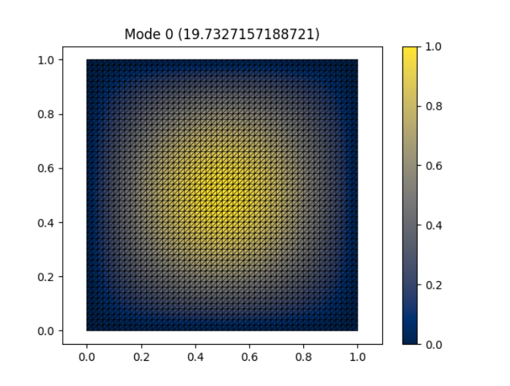

# Laplacian Eigenvalue Problem

## Formulation

### Laplacian Equation

The aim of this is to provide a proof of concept for DEC being applied to solve equations

The equation to solve is a simple laplacian eigenvalue problem:

$\nabla^2 \phi = -\lambda \phi$.

Writing this in exterior calculus form:

$\nabla^2 = d \delta + \delta d$,

where $d$ is the derivative operator and $\delta$ is the codifferential.

If the scalar field $\phi$ is assumed to be divergence free, and the divergence of a scalar field  is given by $\delta \phi$ in exterior calculus, the $\nabla$ operator can be simplified to:

$\nabla^2 = \delta d$

The codifferential is converted to DEC form as:

$\delta \rightarrow \star^{-1} d^{-1} \star$,

hence the Laplacian is converted to DEC as:

$\nabla^2 \rightarrow \star^{-1} d^{-1} \star d$.

### Chen and Chew (pg. 66-7)

For a scalar field $\phi$, the Laplacian is given by:

$\nabla^2 \phi = \nabla \cdot \nabla \phi$,

where the Laplacian $\nabla^2$ is translated to DEC as:

$\nabla^2 \rightarrow -(d^{-1}_0 \star_1 d_0)$.

### Final DEC Eigenproblem Formulation

Representing the scalar field $\phi$ as a 0-form (with values defined on mesh vertices), the eigenproblem can be formulated in DEC as:

$(\star^{-1}_0 d^{-1}_0 \star_1 d_0) \phi = \lambda \phi$.

Here, the operators have the following effects (in a 3D space):
* $d_0$: primal 0-cochain $\rightarrow$ primal 1-cochain
* $\star_1$: primal 1-cochain $\rightarrow$ dual 1-cochain
* $d^{-1}_0$: dual 1-cochain $\rightarrow$ dual 2-cochain
* $\star^{-1}_0$: dual 2-cochain $\rightarrow$ primal 0-cochain

with the Hodge star $\star^{-1}_0$ converting the result of the $\nabla^2$ operation back into the primal mesh to maintain consistent dimensionality in the formulation. 

## Results

The code for this simulation is found in the $Laplace\_square()$ function. 

This also utilises the $FibreSolution$ class to handle basic the mesh generation and plotting, despite the uniform refractive index of $\epsilon = 1.$ throughout the material. Additionally, the solutions are found using the $FibreSolution.solve\_with\_dirichlet\_boundary()$ function, which enforces a Dirichlet boundary condition of $\phi = 0$ around the edge of the simulation area.

Eigenvalues are printed as a list, eigenvalue modes are plotted, and radial cross-section plots are created for the first few modes.

## Analysis

The first few modes are also calculated analytically, and their eigenvalues and corresponding radial mode profiles plotted for comparison.

The simulated eigenvalues are found to be a good match with the theoretical values, and the radial plots (by magnitude) are also similar. This supports the premise that DEC is a valid tool for solving eigenvalue problems.

